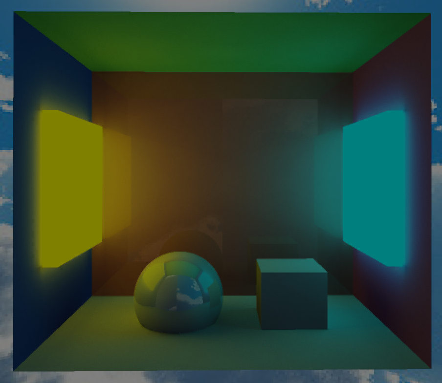
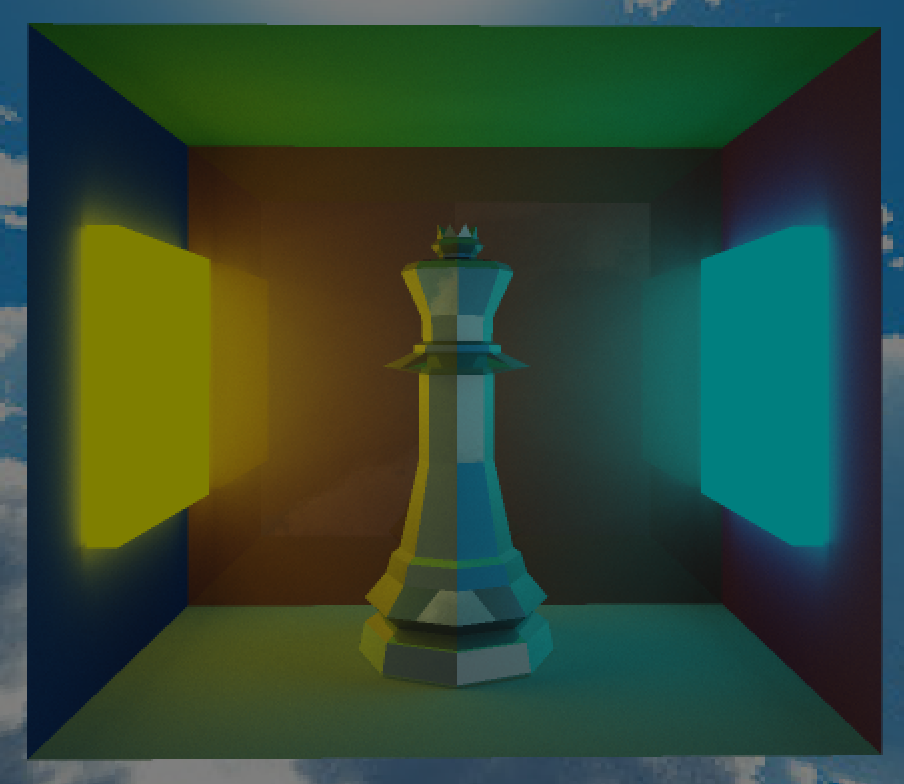

# Ray Tracer

A real-time GPU-accelerated ray tracer built with C++ and OpenGL, featuring BVH acceleration structures, OBJ model loading, and Barycentric normal interpolation for smooth shading.

---

## Gallery
 
| Cornell Box Scene | OBJ Model with Reflections |
|:-:|:-:|
|  |  |

---

## Features

- **BVH Acceleration** — Bounding Volume Hierarchy for fast ray-scene intersection
- **OBJ Model Loading** — Load arbitrary 3D meshes from `.obj` files
- **Barycentric Normal Interpolation** — Smooth per-pixel shading across triangle faces
- **Analytic Primitives** — Built-in sphere and cuboid support
- **Scene File Format** — Declarative text-based scene description (`mesh.txt`)

---

## Build & Run

### Prerequisites

- CMake ≥ 3.10
- A C++17-compatible compiler (GCC, Clang, MSVC)
- OpenGL 4.x capable GPU and drivers
- GLFW, GLAD (or equivalent OpenGL loader)

### Steps

```bash
# Clone the repository
git clone https://github.com/kartenumerator/raytracer.git
cd raytracer

# Create a build directory
mkdir build
cd build

# Configure with CMake
cmake ..

# Compile
make

# Run from the project root (so relative asset paths resolve correctly)
cd ..
./build/raytracer
```

> **Important:** Always run the binary from the project's base directory, not from inside `build/`, so that paths to models and scene files resolve correctly.

---

## Scene Description Format (`mesh.txt`)

Scenes are described in a plain-text file. Each line defines one object or light. **Lines beginning with `n` are ignored** (treated as comments or disabled objects).

### Primitives

#### Sphere

````
sphere  <x> <y> <z>  <radius>  <r> <g> <b>  <reflectance>
````

| Parameter     | Description                          |
|---------------|--------------------------------------|
| `x y z`       | Center position                      |
| `radius`      | Sphere radius                        |
| `r g b`       | Color (0–1 range)                    |
| `reflectance` | Mirror reflectance factor (0.0–1.0)  |

**Example:**
````
sphere  0  -2  -5  2  0 1 1  0.0
````

---

#### Cuboid

````
cuboid  <x> <y> <z>  <length> <width> <height>  <r> <g> <b>  <reflectance>  [triangle_mask]
````

| Parameter       | Description                                                                 |
|-----------------|-----------------------------------------------------------------------------|
| `x y z`         | Center position                                                             |
| `length width height` | Dimensions along each axis                                          |
| `r g b`         | Color (0–1 range)                                                           |
| `reflectance`   | Mirror reflectance factor (0.0–1.0)                                         |
| `triangle_mask` | *(Optional)* Binary number — each `1` bit keeps the corresponding triangle |

**Example:**
````
cuboid  0  -6.25  0    5  7  0.5   0.3 1 0.3   0.0   1100000000
````

The optional `triangle_mask` at the end is a binary string where each digit represents one of the cuboid's triangles (a cuboid has 12 triangles, 2 per face). A `1` keeps the triangle; a `0` removes it. This allows partial cuboids like open boxes or single walls.

---

#### OBJ Model

````
obj  <filepath>  <x> <y> <z>  <rx> <ry> <rz>  <scale>  <r> <g> <b>  <reflectance>
````

| Parameter     | Description                              |
|---------------|------------------------------------------|
| `filepath`    | Path to `.obj` file (relative to root)   |
| `x y z`       | World position                           |
| `rx ry rz`    | Rotation in degrees (Euler angles)       |
| `scale`       | Uniform scale factor                     |
| `r g b`       | Tint color (0–1 range)                   |
| `reflectance` | Mirror reflectance factor (0.0–1.0)      |

**Example:**
````
obj  models/low_poly_king.zip.obj  0 0 0  0 90 0  0.5  1 1 1  0.5
````

---

#### Light

````
n light  <x> <y> <z>  <intensity>  <r> <g> <b>  <reflectance>
````

Defines a point light source. Uses the same positional and color format as other primitives.

---

### Section Labels

You can optionally label regions of your scene file using bare words like `top`, `bottom`, `left`, `right`, `back`. These are parsed as scene section markers for organizational clarity and have no effect on rendering.

---

### Example Scene (`mesh.txt`)

````
sphere  0  -2  -5  2  0 1 1  0.0
sphere  -4  -2  -3  1  1 0 0  0.1

top
cuboid  0  -6.25  0    5  7  0.5   0.3 1 0.3   0.0   1100000000

bottom
cuboid  0  0.25  0    5  7  0.5   1 1 1   0.0   110000000000

left
cuboid  0  -3  -3.75   5  0.5  6   0.3 0.3 1   0.0   11

right
cuboid  0  -3  3.75    5  0.5  6   1 0.3 1      0.0   1100

back
cuboid  2  -3  0    0.5  7  6   1 0.3 0.3   0.1   110000

obj  models/low_poly_king.zip.obj  0 0 0  0 90 0  0.5  1 1 1  0.5
````

---
## Project structure

```
raytracer/
├── .gitignore
├── CMakeLists.txt
├── CMakePresets.json
├── LICENSE
├── bvh.hpp                        # BVH acceleration structure
├── glad.c
├── glad.h                         # OpenGL loader (GLAD)
├── main.cpp                       # Entry point
├── mesh.txt                       # Scene description
├── shaders.h                      # Shader loader utility
├── stb_image.h                    # Image loading (STB)
├── test.cpp
├── localstore/                    # Cached build artefacts
|   ├── log.txt                    # Vertex shaders
|   ├── mesh.txt                   # scene data
|   ├── store.txt                  # stores camera 
|   └── skybox.jpg                 # skybox
├── models/
│   └── low_poly_king.zip.obj
└── shaders/
    ├── default.vert               # Vertex shaders
    ├── raytracer.comp             # Raytracing compute shader
    ├── pathtracer.comp            # experimental raytracer
    └── fragment.frag              # Fragment shaders
```

---

## License

GNU License — see [LICENSE](LICENSE) for details.